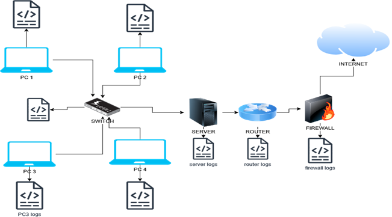

# Windows Event Monitoring UsingSplunk In A Simulated SOC Lab
### SOC Lab without Splunk, each component generate and keeps its Logs

## Project Objective
To simulate a basic SOC environment by collecting and monitoring system logs using Splun ES,and creating alerts for potential security incidents (Brute force  attempt, failed Logins etc), Create and visualize results on a dashboard.
### SOC Labs with Splunk forwarders ingesting logs to Splunk ES

## Tools Used
-Splunk ES (Installed locally)
-Splunk Forwarders (Installed on VM)
-Windows 10 VM with Sysmon installed
## Project Task and Steps
## 1 Setup Splunk ES
- Installed Splunk Locally
- Create a Splunk admin account
- Enable port 8000 access
 ## 2  Install and Configured  Sysmon on Windows
 - Used SwiftOnSecurity Sysmon configuration
 - Log Key Activities like process creation, Network Connections, File creation
## 3 Forward logs to Splunk
- Used Splunk Universal Forwarder to collect logs from VMs to Splunk ES
- Indexand Tag Logs sources as Windows and Sysmon.
## 4 Create Dashboards
## 5 Set Detection Alert
## 6 Simulate Attacks
## 7 Document Your Findings

